# ChefInKitchen Architecture Analysis

## Current Three-Layer Architecture

Your current implementation uses:

```mermaid
flowchart LR
    subgraph Client["🖥️ Client Layer"]
        React["React + ElevenLabs SDK"]
    end
    
    subgraph Agent["🎙️ Voice Layer"]
        EL["ElevenLabs Agent"]
    end
    
    subgraph Backend["⚙️ Backend Layer"]
        Server["Node.js Server"]
        Gemini["Gemini API"]
    end
    
    Client <-->|"Audio Stream"| Agent
    Agent <-->|"Webhook Tools"| Server
    Server <-->|"Recipe Logic"| Gemini
```

**Why this exists:**
1. **ElevenLabs Agent** handles voice (STT + TTS + personality)
2. **Your Server** maintains cooking state (current step, recipe, session)
3. **Gemini** provides recipe intelligence

---

## Do You Need Three Layers?

### Answer: **It depends on your priorities**

| Priority | Recommended Architecture |
|----------|-------------------------|
| **Fastest MVP** | Two-layer (ElevenLabs + Gemini direct) |
| **Best voice quality** | Current three-layer |
| **Lowest latency** | Two-layer with Gemini Live API |
| **Production-ready** | Current three-layer (with modifications) |

---

## Alternative Architectures

### Option 1: Two-Layer with ElevenLabs + Gemini Integration

ElevenLabs now supports **direct Gemini integration** as an LLM provider:

**Pros:**
- ✅ No backend server needed
- ✅ Simpler deployment (just static frontend)
- ✅ ElevenLabs handles all orchestration
- ✅ Can use Gemini directly in ElevenLabs dashboard

**Cons:**
- ❌ Limited state management (no persistent recipe state)
- ❌ Harder to implement complex cooking flow logic
- ❌ Knowledge base only via context/prompts

> [!IMPORTANT]
> This works if you can encode ALL recipe logic into the system prompt and rely on Gemini's context window for state.

---

### Option 2: Two-Layer with Gemini 2.0 Flash Live API

Google's new **Live API** provides native real-time voice:

```mermaid
flowchart LR
    subgraph Client["🖥️ Client"]
        React["React App"]
        Mic["Microphone"]
        Speaker["Speaker"]
    end
    
    subgraph Google["☁️ Google Cloud"]
        Gemini["Gemini 2.0 Flash Live API"]
    end
    
    Mic -->|"Audio Stream (WebSocket)"| Gemini
    Gemini -->|"Audio Response"| Speaker
```

**Pros:**
- ✅ Lowest possible latency (direct WebSocket to Gemini)
- ✅ Native multimodal (can add camera input later)
- ✅ Built-in voice activity detection
- ✅ Supports function calling for state management
- ✅ No third-party voice services needed

**Cons:**
- ❌ Voice quality may be inferior to ElevenLabs
- ❌ Less control over voice personality/emotion
- ❌ Still relatively new (May 2025 GA)
- ❌ Requires server-side authentication for production

> [!TIP]
> This is ideal if you want a pure Google stack and can sacrifice some voice expressiveness.

---

### Option 3: Current Architecture (Refined)

Keep your current setup but simplify:

```mermaid
flowchart LR
    subgraph Client["🖥️ Client"]
        React["React + ElevenLabs SDK"]
    end
    
    subgraph ElevenLabs["🎙️ ElevenLabs"]
        Agent["Conversational Agent<br/>(with Gemini as LLM)"]
    end
    
    subgraph Backend["⚙️ Your Backend"]
        State["State Server<br/>(Cloud Run)"]
    end
    
    Client <-->|"Audio"| Agent
    Agent <-->|"Function Calls"| State
```

**What changes:**
- Move Gemini calls INTO ElevenLabs Agent (use Gemini as LLM provider)
- Your server becomes a thin **state-only** service
- Eliminates duplicate Gemini calls

---

## Recommendation

### For Hackathon/MVP: **Option 1 or 2**

| Scenario | Choice |
|----------|--------|
| Want best voice expressiveness | Option 1 (ElevenLabs + Gemini) |
| Want simplest architecture | Option 2 (Gemini Live API only) |
| Need custom chef persona | Option 1 |

### For Production: **Option 3 (Current, refined)**

Your current architecture is actually well-designed for production because:
1. State management needs persistent storage (Firestore)
2. Webhook-based tools give you audit logging
3. You can swap LLM providers easily

---

## Key Questions to Decide

1. **How important is ElevenLabs voice quality?**
   - If critical → Keep ElevenLabs
   - If acceptable → Consider Gemini Live API

2. **Do you need stateful cooking sessions?**
   - If yes → Keep your backend (at least for state)
   - If no → Can go serverless with Option 1

3. **Is this for a hackathon or production?**
   - Hackathon → Simplify to 2 layers
   - Production → Keep 3 layers with state server

---

## Implementation Effort Comparison

| Architecture | Files to Change | Effort |
|--------------|----------------|--------|
| Keep current | 0 | None |
| Option 1 (ElevenLabs + Gemini direct) | Remove `gemini.js`, modify agent config | 2-4 hours |
| Option 2 (Gemini Live API) | Rewrite `client/`, remove server | 8-16 hours |
| Option 3 (Refined current) | Modify agent to use Gemini LLM, simplify server to state-only | 4-6 hours |
